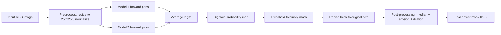

# Slide 1 - Method Description

## Approach (Defect Segmentation on Toothbrush Images)

- Task: binary segmentation of defective regions (mask values 0 or 255).
- Dataset split: **70% training, 10% validation, 20% testing**.
- Backbone: U-Net trained with BCE loss. (U-Net is a CNN architecture designed for image segmentation, specially effective for biomedical images.)
- Inference strategy: checkpoint ensemble averaging (models listed in [trained_models/ensemble_weights.txt](trained_models/ensemble_weights.txt)).
- Post-processing: median filter, erosion, dilation to reduce noise and fill small gaps.
- Decision rule: global probability threshold (default 0.65 in [model.py](model.py)).

## Processing Pipeline

---

# Slide 2 - Results Analysis

## Quantitative Results (Current Final Local Setup)

Evaluation split: [data/toothbrush_dataset/testing.csv](data/toothbrush_dataset/testing.csv) (18 images)

Representative confusion matrix (pixel-level, scikit-learn visualization):

Pixel-level confusion counts: TP=141,265; FP=16,653; TN=18,705,167; FN=11,283

- Pixel-level metrics:
  - Accuracy = 0.9985
  - Precision = 0.8945
  - Recall = 0.9260
  - F1 = 0.9100
  - IoU = 0.8349
- Defective-only summary:
  - mean IoU = 0.7505
  - mean F1 = 0.8531

Critical interpretation:

- The image-level confusion matrix is perfect locally, but it is not the most informative indicator for segmentation quality in this task.
- Pixel-level metrics reveal real residual errors: both false positives (16,653) and false negatives (11,283) remain significant on defect boundaries.
- This explains why local metrics can look excellent while benchmark performance still saturates around 0.75.

## Representative Example(s)

**Good representative case**  

**Failure representative case**  

## Why local results differ from CodaBench

- Small local split (18 test images) leads to high variance and optimistic estimates.
- Repeated model/threshold selection on the same local distribution causes implicit overfitting to local data characteristics.
- Hidden CodaBench set likely has different image statistics (lighting, texture, defect morphology), so a single global threshold can underperform.
- Local analysis uses pixel metrics on known labels; CodaBench score is computed on unseen data and may emphasize errors that are underrepresented locally.

## Limitations and Failure Cases

- Failure pattern 1: under-segmentation of thin or fragmented defects (higher FN regions).
- Failure pattern 2: over-segmentation around high-texture zones (higher FP regions).
- Likely causes:
  1. Limited training diversity for edge-case defect shapes.
  2. Fixed threshold and fixed morphology kernels for all samples.
  3. Ensemble improves robustness but cannot fully solve boundary ambiguity.
- Representative difficult samples from [analysis/testing_eval/evaluation_report.json](analysis/testing_eval/evaluation_report.json):
  - defective/009.png (IoU about 0.608)
  - defective/027.png (IoU about 0.617)
